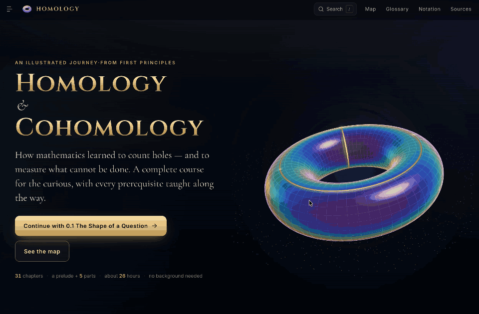

<p align="center">
  <a href="https://neovand.github.io/homology/"></a>
</p>

# Homology & Cohomology — an illustrated journey

An interactive, illustrated textbook that teaches **homology** and **cohomology** from first principles —
including every prerequisite (logic, sets, groups, linear algebra, topology, manifolds, differential forms,
category theory) — with live 3D figures, explorable diagrams, and a built-in homology calculator.

**Read it:** https://neovand.github.io/homology/

## What is inside

A prelude and five parts, 31 chapters, about 200,000 words and 260 figures:

| Part | Chapters |
|---|---|
| Prelude | The shape of a question · How to read mathematics |
| I. Foundations | Sets and functions · Equivalence and quotients · Groups · Abelian groups and formal sums · Linear algebra |
| II. Topology | Spaces and continuity · Gluing · Homotopy · Manifolds and surfaces · Simplicial complexes · The Euler characteristic |
| III. Homology | Cycles and boundaries · Chains · Homology groups · Computing homology · Invariance and first triumphs · Exact sequences and Mayer–Vietoris · Persistent homology |
| IV. Cohomology | Cochains · Cohomology groups · Differential forms · de Rham cohomology · The cup product · Poincaré duality · Sheaves and Čech cohomology · Characteristic classes |
| V. The big picture | Categories and functors · Homological algebra · Horizons |

Every chapter has interactive figures, worked examples, exercises with hidden hints and solutions, a summary,
a list of the references it cites and annotated further reading. A searchable glossary (about 700 terms, each linked from the text), a notation
table, a one-page cheat sheet and a map of how the chapters depend on each other complete the book.

## Built with

[SvelteKit](https://svelte.dev/docs/kit) (prerendered to a static site), Svelte 5, [three.js](https://threejs.org)
with custom GLSL shaders, and [KaTeX](https://katex.org), with all math in the chapters rendered at build time.
The homology computations in the figures run on a small, tested math engine in `src/lib/math`
(simplicial complexes; homology over ℤ, ℤ/2 and ℚ with Smith normal form; persistence; Hodge decomposition).

## Develop

```sh
npm install
npm run dev        # local dev server
npm run check      # svelte-check, aware of the build-time math
npm test           # math engine, figures' helpers, glossary and chapter-structure tests
npm run build      # static site in build/
```

Set `BASE_PATH=/homology` when building for the GitHub Pages project URL (the workflow does this).

## Writing

`docs/AUTHORING.md` is the house guide: voice, chapter anatomy, notation, which chapter introduces which
concept, colour semantics, the component library and the checks to run.

In any `.svelte` file, write inline math as `\( … \)` and display math as `\[ … \]`. A Svelte preprocessor
(`src/lib/katex/preprocess.js`) renders it to HTML at build time and gives each formula an accessible label.

## Deploy

`.github/workflows/deploy.yml` tests, builds and publishes the site on every push to `main`. GitHub Pages must
be enabled once for the repository: **Settings → Pages → Build and deployment → Source: GitHub Actions**.
